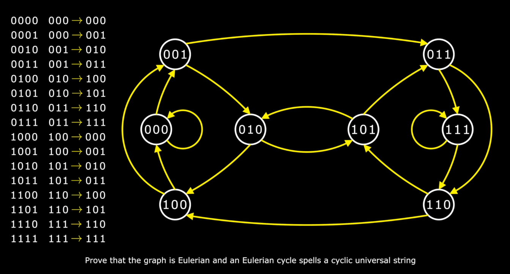

# Module 1: Programming Challenges Notes

- Algorithms are everywhere
- Prerequisite: Python + Discrete mathematics
- Famous problems:

  - Eternity 2: unsolvable
  - Human Genome Assemble: largest
    - Long string with 4 nucleotides: AGCT
    - 3 billion characters
  - Seven Bridges of Konigsberg
    - Since every node in this graph has an odd degree, there is no walk through Konigsberg visiting every bridge exactly once
  - One stroke
    - Draw figures without ever lifting your pencil
    - One simple rule: prove that figure has an Eulerian Cycle
      - Mean that the figure either balanced (zero odd nodes) or has two odd nodes (nodes of odd degree)
  - Snow plow (example 3x3)
    - Find a shortest snow plow route to visit all city blocks
    - And return to its original location
    - It traverses an Eulerian Cycle in a graph where each edge that is traversed `N` times are substitured by by `N` parallel edges
    - Thus our goal is the turn the grid graph into eulerian by adding as few such edges as possible for the 3x3 grid
    - The best way is to add four edges, each added edge indicates that the the snow plow will traverse a city block more than once
    -
  - Universal String
    - Find a string that contains each binary string of length `k` as a substring exactly once
    - e.g., `0011101000` with `k = 3` is a universal string because it contains `001`, `011`, `111`, `110`, `101`, `010`, `100`, `000` exactly once each string
    - The algorithms for this problem are quite similar to the algorithms that biologists use for `Genome Assembly` (with `k = 10`)
  - Josephus problem <!--TODO:-->

- A graph is a collection of nodes and edges between them
- The degree of a node is defined as the number of edges incident to this node
- A cycle in a graph is called Eulerian if it visits every edge exactly once
- A graph is called Eulerian if it has an Eulerian cycle
- All nodes of an Eulerian graph are even
- A graph is balanced if all its nodes are even
- Eulerian Cycle Theorem
  - A connected graph is Eulerian if and only if it is balanced
  - A connected graph has an Eulerian path if and only if it is either balanced or has two odd nodes, i.e., nodes of odd degree

<strong>Snow plow puzzle solution (3x3)</strong>

Add 4 edges to make it Eulerian Cycle

<strong>Snow plow puzzle solution (4x4)</strong>

Add 8 edges to make it Eulerian Cycle

<strong>Universal String Proof</strong>

